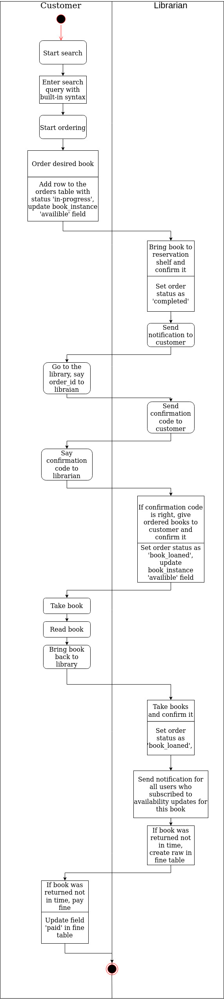

Local Library is an application for upgrading an old library in Siusarna hometown
## Main functionality:
- Authorization  
   -Directly  
   -With Telgram  
   -With Google account  
   -With Facebook  
- Roles  
   -Librarian  
   -Unauthorized user  
   -Regular authorized user  
   -Restricted authorized user  
- As Librarian you can  
   -CRUD Book  
   -CRUD Book Instance  
   -CRUD Author  
   -CRUD News  
   -Confirm order  
   -Confirm that book was taken  
- As unauthorized user you can  
   -View news  
   -Search for books  
- As restricted authorized user you can  
   -Do all things that unauthorized user can do  
   -Subscribe to availability updates for books  
   -Rate books  
   -Leave a book review  
- As regular authorized user you can  
   -Do all things that restricted authorized user can do  
   -Order books  
   -Other features  
- Users receives notifications when  
   -Order is completed  
   -There are 7 days left to return books  
   -There is 1 day left to return books  
   -He failed to return books in time  
- If user fails to return book in time he becomes restricted user until he returns the book and pays a fine (certain amount of money per day).
  Restricted user can pay a fine online.
- Telegram bot where  
   -User receives all notifications  
   -User can find, order or observe book  
- Book search allows user to  
   -Find by certain field (TITLE, AUTHOR etc)  
   -Use logical operators (OR, AND, NOT)  
   -Use comparison operators (CONTAINS, =, >)  

## Technologies:

### Front-end:
- React
### Back-end:
- Koa
- PostgreSQL
- AWS CI\CD
- Jest
- Redis
- Bull

## Data flow:

## DataBase Structure

